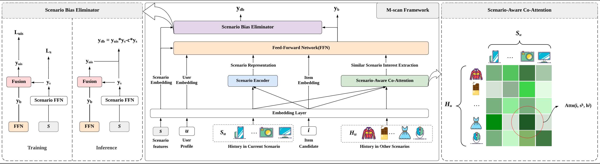
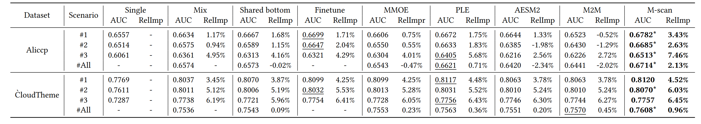

# M-scan
The implementation of M-scan algorithm

## Model Overview



## Requirements

python >=3.6

torch >=1.0

pandas

tqdm

numpy

pickle

recbole

## Main Experiment of M-scan



## Datasets

[Ali-CCP: Alibaba Click and Conversion Prediction_数据集-阿里云天池 (aliyun.com)](https://tianchi.aliyun.com/dataset/408)

[Cloud Theme Click Dataset / 云主题点击数据集_数据集-阿里云天池 (aliyun.com)](https://tianchi.aliyun.com/dataset/9716)

## Data preprocessing

The code data preprocessing is stored in process_xxx.py, where xxx is our two datasets aliccp and cloud.

For example:

```shell
python process_aliccp.py
```


## Training

After you've preprocessed all the data, you can do the training by the following command

```shell
python train.py -d aliccp -m m_scan
```

In this command, Aliccp is a dataset, and m-scan is our proposed model.

All the train hyperparameters are stored in configs/train_configs

All the model hyperparameters are stored in configs/model_configs

All the data information are stored in configs/data_configs

